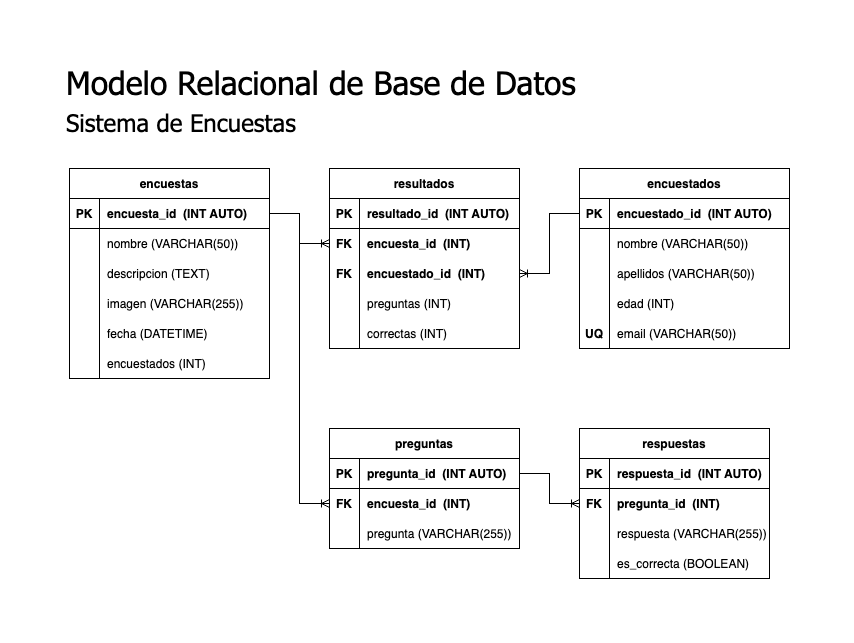

# Sistema de encuestas

# Lista de entidades

### encuestas **(ED)**

- id **(PK)**
- nombre
- descripcion
- imagen
- fecha
- encuestados

### preguntas **(ED)**

- id **(PK)**
- encuesta_id **(FK)**
- pregunta (es la pregunta en texto, no hace referencia a algo)

### respuestas **(ED)**

- id **(PK)**
- pregunta_id **(FK)**
- respuesta (es la respuesta en texto, no hace referencia a nada)
- es_correcta

### encuestado **(ED)**

- id **(PK)**
- nombre
- apellido
- mail **(UQ)**
- edad

### resultado **(ED|EP)**

- id **(PK)**
- encuesta_id **(FK)**
- encuestado_id **(FK)**
- preguntas
- correctas

# Relaciones

- **encuestas** tiene **preguntas** (1 a M)
- **preguntas** tiene **respuestas** (1 a M)
- **encuesta** tiene **resultados** (1 a M)
- **encuestado** tiene **resultados** (1 a M)

# Modelo Relacional

# Reglas de negocio

### encuestas

1. Crear encuesta
2. Leer encuestas
3. Leer encuesta en específico
4. Eliminar encuesta
5. Actualizar valor +1 del campo **encuestados** cuando un encuestado realiza la encuesta

### preguntas

1. Crear pregunta
2. Leer preguntas
3. Leer pregunta específica
4. Editar pregunta
5. Eliminar pregunta

### respuestas

1. Crear respuesta
2. Leer respuestas
3. Leer respuesta específica
4. Actualizar respuesta
5. Eliminar respuesta

### encuestados

1. Crear
2. Leer todos
3. Leer específico
4. Actualizar
5. Eliminar
6. Antes de crear un encuestado, verificar que no haya sido creado ya con un correo existente

### resultados

1. Crear
2. Leer todos
3. Leer específico
4. Actualizar
5. Eliminar
6. Sacar el porcentaje de asertividad del encuestado al momento de resolver la encuesta.
