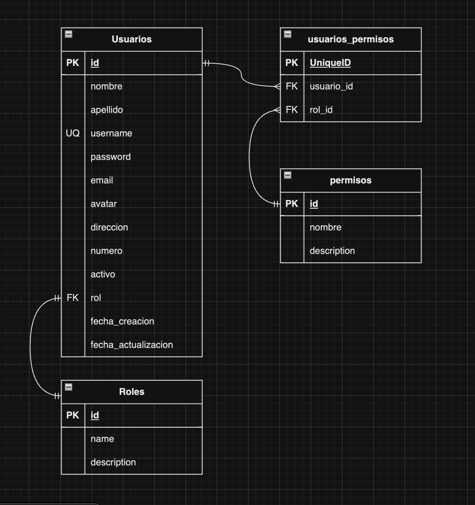

# Sistema de autenticacion

> [!IMPORTANT]
> Para comenzar con el diseño de la base de datos debes serguir los pasos que estan en
> [Pasos par el diseño](../Diseño%20de%20BDD/readme.md)

# Lista de identidades

### usario **(ED)**

- id **(FK)**
- nombre
- apellido
- username **(UQ)**
- password
- email **(UQ)**
- avatar
- direecion
- numero
- activo
- rol_id **(FK)**
- fecha_creacion
- fecha_actualizacion

### rol **(EC)**

- id **(PK)**
- nombre
- descripcion

### usuarios_permisos **(ED)**

- id **(PK)**
- usuario_id **(FK)**
- permiso_id **(FK)**

### permisos **(ED)**

- id **(PK)**
- nombre
- descripcion

# Relaciones

1. un **usario** tiene un **rol** (1 a 1)
2. un **usuario** tiene un **permiso** (1 a M)
3. un **permiso** tiene un **usauario** (1 a M)

# Diagrama

# Logica de negocio

### Usuario

1. Crear
2. listar todos
3. Listar espesifico
4. Actualizar
5. Eliminar

### Rol

1. Crear
2. listar todos
3. Listar espesifico
4. Actualizar
5. Eliminar

### Permisos

1. Crear
2. listar todos
3. Listar espesifico
4. Actualizar
5. Eliminar

### Usuarios_permisos

1. Crear
2. listar todos
3. Listar espesifico
4. Actualizar
5. Eliminar
